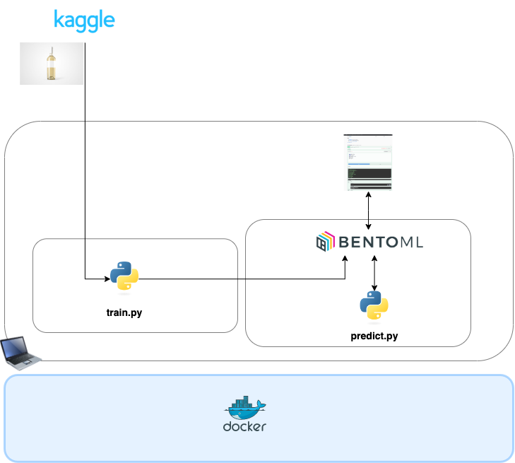
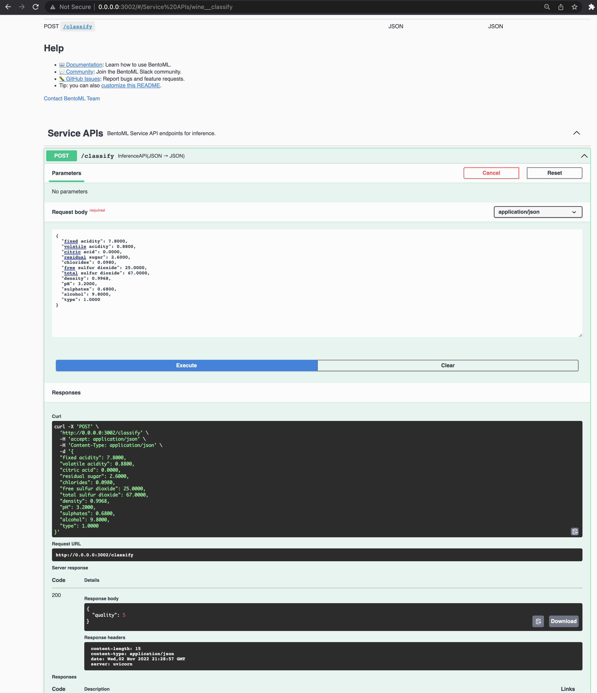

# Machine Learning Zoomcamp - Capstone Project -  Wine Quality

## Description

This project is created as the capstome project of the [Machine Learning Zoomcamp](https://github.com/alexeygrigorev/mlbookcamp-code/tree/master/course-zoomcamp), and it will be peer reviewed and scored.

The objective is to build a model to predict the quality of the wine. 

## Dataset

This project uses the wine quality datasets available at the [UCI website](https://archive.ics.uci.edu/ml/datasets/wine+quality).
The two datasets are related to red and white wine samples, from the north of Portugal.

## System architecture and Technologies

The following figure depicts the system architecture and technologies used:

## Setup

This project has as main pre-requisites:
- Python 3.10
- Docker 20.10.20
- Bentoml 1.0.8

How to run:
1. Clone this repo
2. Open a terminal within that folder
3. Run `pip install pipenv`
4. Run `pipenv install`, to install the dependencies from Pipfile 
5. Run `pipenv shell`
6. Run `python train.py`
7. Run `bentoml build`
8. Run `bentoml containerize wine`
9. Run `docker run -it --rm -p 3000:3000 wine:<tag> serve --production`, where tag is obtained in the previous step.
10. Finally, run `python test_predict.py` to send API requests to test it, or use the Swagger-UI as shown in the following figure:

